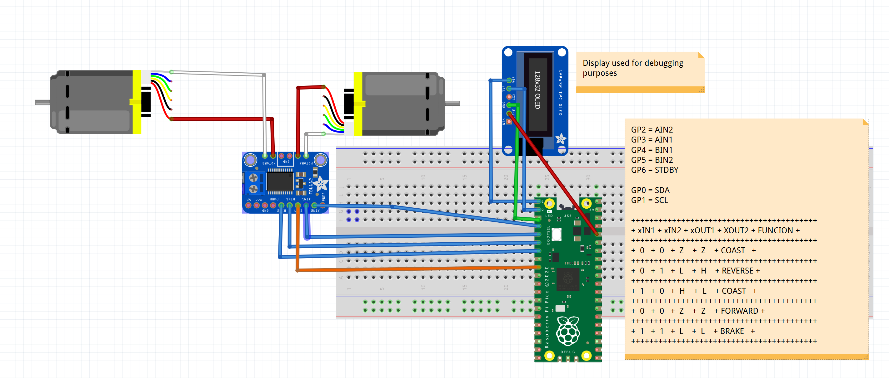

# 2WD robot based on ROS2
## Introduction

This repository includes the steps to create a 2WD robot for autonomous navitation using ROS2

## Technologies

### Hardware

- Raspberry Pico for motor driver - connected trough USB so pico W is not required (1)
- Motor Driver DRV8833 (better performance than LM328)  (1)
- DC Motors with hall or optic encoder  (2) to run 2WD vehicle
- Jetson Nano (1) or Raspberry PI (1) to run ROS2


### Software

- C++
- Raspberry Pico SDK
- Python 3.8.10
- Ubuntu 22.04LTE
- ROS 2 Humble
- VSC 

## Setup

This is only for checking motor integration. No encoder input at this time.



## folder:  ./prototype <br> This foldar contains first rutine test of the motor driver <br>  List of programs description:

### 1. motor_driver

#### Objective

Test motor 2 motor movement, direction forward/reverse

#### Expected behaviour

```
while(1)
{
    Motor 1 move forward
    Motor 1 move backward
    Motor 1 stop

    Motor 2 move forward
    Motor 2 move backward
    Motor 2 stop
}
```
### 2. motor2_driver

#### Objective

Test motor speed control

#### Expected behaviour


```
while(1)
{
    Motor 1 move forward full speed
    Motor 2 move forward full speed

    Motor 2 move backward full speed
    Motor 2 move backward full speed

    Motor 2 move backward half speed
    Motor 2 move backward half speed
}
```

### 3. motor3_driver

Only some testing. Anything too much relevant.

### 4. motor4_ros

First testing of a node for raspberry pico for subscribe and publish data to/from motors using micro ROS
The code uploaded into the raspberry pico creates some ROS2 objects:

**subscriber**
/mobile_base_controller/cmd_vel (Type: geometry_msgs/msg/Twist)

**publisher**
/pico_publisher (Type: std_msgs/msg/Int32)

Compile and copy the program into raspberry-pico:

```
cd build
make
cp motor4_ros.uf2 /media/administrator/RPI-RP2/
```

execute the following code into the master device that the raspberry pico is connected to on a *terminal 1*:

```
sudo docker run --device=/dev/ttyACM0:/dev/ttyACM0 -it --rm --net=host microros/micro-ros-agent:foxy serial --dev /dev/ttyACM0 baudrate=115200
```

you can test the connection using this command on a *terminal 2* (linear x is the speed, angular z is the steering):
```
ros2  topic  pub --once /mobile_base_controller/cmd_vel geometry_msgs/msg/Twist "{linear: {x: 80.0, y: 0.0, z: 0.0}, angular: {x: 1, y: 2.0, z: 1.8}}"

```

## Status

At this state I'm testing raspberry pico before integrating as a ros2 node to move motors and collect telemetry

## Me

I'm Juan Ramirez Jardua, electrical engineer. My main function is to implement and support GxP systems in the pharmaceutical industry, but in my free time I enjoy with robotics, photography, cats and other hobbies.

If you like photography as I do, you can visit me at [@juanramirezj]


[//]: # (Links)

[@juanramirezj]: <https://www.instagram.com/juanramirezj/>


